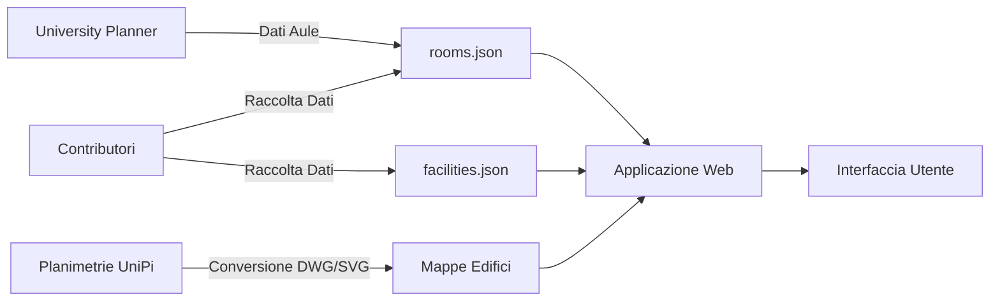
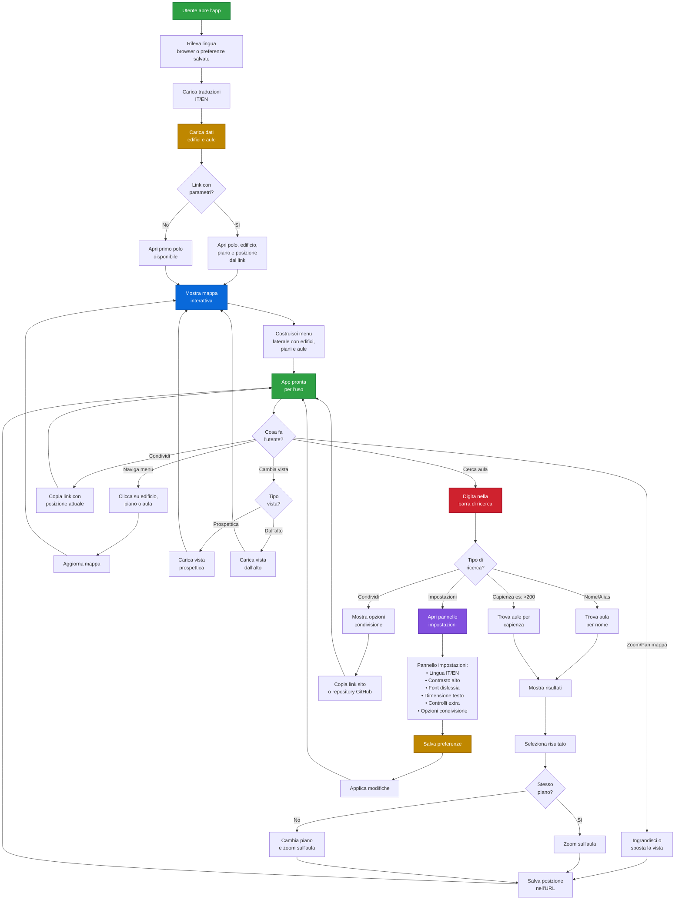
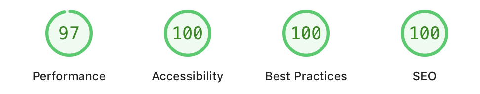
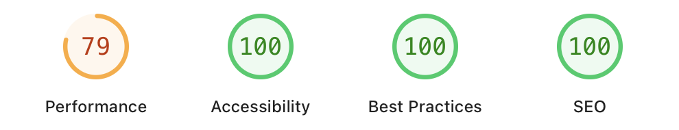
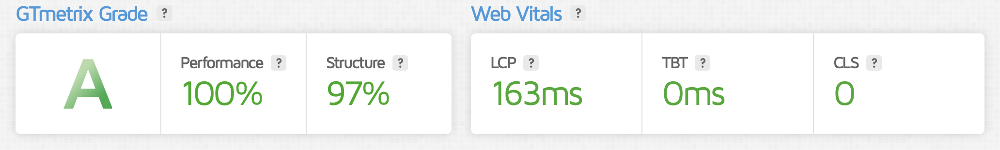

<p align="center">
  
</p>

<h1 align="center"> DOVE?UniPi </h1>

<p align="center">Un'applicazione web single-page (SPA) per esplorare gli edifici, i piani e le aule del Polo Fibonacci dell’Università di Pisa.</p>

<p align="center">L’interfaccia consente di navigare in modo interattivo tra gli edifici, visualizzare mappe .SVG dei piani e ottenere dettagli sulle singole aule.</p>


<h2 align="right"> SCREENSHOT </h2>

<p align="center">
  
</p>

> Per rendere il progetto ulteriormente **accessibile a TUTTI**, oltre a un'interfaccia intuitiva e diretta, è disponibile una [**guida**](assets/screenshots/spiegazione.png) che spiega i vari elementi e pulsanti dell'applicazione.


## Indice

- [Indice](#indice)
- [Contributori](#contributori)
- [Perché?](#perché)
- [Struttura del progetto](#struttura-del-progetto)
- [rooms.json](#roomsjson)
- [Flowchart](#flowchart)
  - [Flusso Dati](#flusso-dati)
  - [Architettura del Progetto](#architettura-del-progetto)
- [Prestazioni](#prestazioni)
  - [PageSpeed Insights](#pagespeed-insights)
  - [GTmetrix](#gtmetrix)
- [Funzionalità](#funzionalità)
  - [Ricerca intelligente](#ricerca-intelligente)
  - [Accessibilità](#accessibilità)
  - [Keyboard shortcuts](#keyboard-shortcuts)
  - [Path sharing](#path-sharing)
  - [Lingue supportate](#lingue-supportate)
  - [Altri dati](#altri-dati)
    - [Distributori d'acqua](#distributori-dacqua)
- [Funzionalità che vorrei aggiungere](#funzionalità-che-vorrei-aggiungere)
- [Problemi noti](#problemi-noti)
  

## Contributori

[](https://github.com/calba-droid)
[](https://github.com/plumkewe)
[](https://github.com/piorpiedev)
[](https://github.com/L-myself)
[](https://github.com/gregoriop06)

*Un ringraziamento speciale a chi ha dedicato il proprio tempo per la raccolta dati nelle aule.*


## Perché?

<p align="right">(<a href="#indice">indice</a>)</p>


L'idea nasce da un'esigenza personale, sorta fin dal primo giorno di università, quando ci dissero di recarci in un'aula specifica, in un edificio di cui nessuno sapeva nulla.

Ho capito subito che non ero l'unico ad avere questo problema. Mi è capitato spesso, sia di persona che nelle chat di gruppo, di vedere richieste di aiuto per trovare un'aula.

A dimostrazione di ciò, ecco alcuni messaggi reali presi da un gruppo Telegram:

> "Qualcuno del corso C mi può aiutare a trovare l'aula per favore?"

> "Qualcuno sa dov'è l'aula M1?"

> "L'aula D3 dove è?"

> "Sapete dirmi dove è questa aula M1?"

> "L'aula H dov'è?"

...e tanti altri. Da qui l'ispirazione per il nome del progetto: **DOVE?**

> [!NOTE]
> Il progetto è in sviluppo, contribuisci!


## Struttura del progetto

<p align="right">(<a href="#indice">indice</a>)</p>


```graphql
├── README.md
├── assets/
│   ├── fonts/  
│   ├── logo/
│   │   ├── favicon.png
│   │   └── logo.svg
│   └── screenshots/
├── data/
│   ├── rooms.json      <- file importante per far funzionare tutto
│   └── facilities.json 
├── locales             <- cartella per le traduzioni 
│   └── en.json
│   └── it.json
├── index.html
└── polo/ <- dove aggiungere altri poli
    └── fibonacci/
        ├── edificio/
        │   ├── a/
        │   │   └── piano/
        │   │       ├── 0-top-max.svg <- top sta per vista e max sta per non ottimizzato (non si usano)
        │   │       ├── 0-top.svg
        │   │       ├── 0.dwg <- file CAD del piano 
        │   │       ├── 0.svg <- vista prospettica
        │   │       ├── 1-top-max.svg
        │   │       ├── 1-top.svg
        │   │       ├── 1.dwg
        │   │       ├── 1.svg
        │   │       ├── 2-top-max.svg
        │   │       ├── 2-top.svg
        │   │       ├── 2.dwg
        │   │       └── 2.svg
        │   ├── b/
        │   │   └── ...
        │   ├── c/
        │   │   └── ...
        │   ├── d/
        │   │   └── ...
        │   └── e/
        │       └── ...
        └── mini-map.svg <- mini mappa (non si usa)
```

## rooms.json

<p align="right">(<a href="#indice">indice</a>)</p>


È il "database" dell'applicazione.

Contiene tutti i dati su edifici, piani e aule, e l'interfaccia viene costruita dinamicamente leggendo questo file. Per aggiornare i contenuti, basta modificare rooms.json senza toccare il codice.

```json
{
  "polo": {
    "fibonacci": {
      "edificio": {
        "a": {
          "..."
        },
        "b": {
          "..."
        },
        "c": {
          "..."
        },
        "d": {
          "piano": {
            "0": [
              {
                "id": "fib_d2-d-0",
                "nome": "Aula D2",
                "alias": [
                  "D2",
                  "Informatica",
                  "Corso B",
                  "Matricole",
                  "Matricole Informatica"
                ],
                "capienza": 206,
                "presenza_pc": false,
                "numero_pc": 0,
                "prese_elettriche": true,
                "numero_prese_elettriche": 0,
                "porte_rete": false,
                "proiettore": true,
                "lavagna": "nera",
                "type": "aula",
                "note": "",
                "rete": false,
                "accesso_disabili": true,
                "coordinates": {
                  "x": 380,
                  "y": 296,
                  "zoom": 2
                }
              },
              {
                "..."
              },
              {
                "..."
              },
              {
                "..."
              }
            ]
          }
        },
        "e": {
          "..."
        }
      }
    }
  }
}
```

## Flowchart

<p align="right">(<a href="#indice">indice</a>)</p>

### Flusso Dati



### Architettura del Progetto



## Prestazioni

### PageSpeed Insights

<table>
  <thead>
    <tr>
      <th>DESKTOP</th>
      <th>MOBILE</th>
    </tr>
  </thead>
  <tbody>
    <tr>
      <td></td>
      <td></td>
    </tr>
    <tr>
      <td colspan="2"><a href="https://pagespeed.web.dev/analysis/https-plumkewe-github-io-dove-unipi/uxur6o8s0g" target="_blank" rel="noopener noreferrer">Apri il report completo su PageSpeed Insights</a></td>
    </tr>
  </tbody>
</table>

### GTmetrix

<table>
  <tbody>
    <tr>
      <td></td>
    </tr>
    <tr>
      <td><a href="https://gtmetrix.com/reports/plumkewe.github.io/3r3h8Uf8/#" target="_blank" rel="noopener noreferrer">Apri il report completo su GTmetrix</a></td>
    </tr>
  </tbody>
</table>

## Funzionalità

<p align="right">(<a href="#indice">indice</a>)</p>


### Ricerca intelligente 

Effettua una ricerca non solo sul nome dell’aula ma anche sui suoi **alias**. Una volta selezionata, l’aula verrà automaticamente zoomata sulla sua posizione (ovviamente, se le coordinate sono presenti nel file rooms.json).

Supporta inoltre **filtri avanzati**: ad esempio, scrivendo `> 200` verranno mostrate le aule con capienza superiore a 200.  
Sono supportati gli operatori: `<`, `>`, `==`, `=`, `>=`, `<=`.

Puoi accedere alle **impostazioni** digitando `impostazioni` o `settings` nella barra di ricerca.  
Da lì puoi abilitare anche le **funzionalità sperimentali**.

Digitando `condividi` o `share`, potrai facilmente copiare il **link al sito** o a questa **repository** per condividerlo.

Digitando `feedback` troverai due risultati per fornire feedback sul progetto. Inoltre, quando non trovi ciò che cerchi, ti verrà proposto automaticamente di lasciare un feedback per aiutarci a migliorare!

Usa le frecce <kbd>↑</kbd> e <kbd>↓</kbd> per scorrere i risultati e premi <kbd>Invio</kbd> per selezionarne uno.
La ricerca si avvia automaticamente mentre digiti — non serve cliccare sulla barra di ricerca.

<hr>

### Accessibilità 

Attualmente è possibile aggiungere **pulsanti extra** per funzioni come **zoom** e **condivisione,** oltre ad attivare la **modalità ad alto contrasto.**
È inoltre possibile aumentare **la dimensione del testo** e attivare il **font per dislessia (OpenDyslexic).**

Puoi accedere alle **impostazioni di accessibilità** digitando `impostazioni` o `settings` nella barra di ricerca.  

In futuro si prevede di introdurre una **modalità di navigazione basata solo su pulsanti**.
*(Non garantiamo nulla in questa fase di sviluppo.)*

<hr>

### Keyboard shortcuts

Al momento sono disponibili le seguenti scorciatoie:

<table>
  <thead>
    <tr>
      <th>Funzione</th>
      <th>Mac</th>
      <th>Windows / Linux</th>
    </tr>
  </thead>
  <tbody>
    <tr>
      <td>Copia il link da condividere</td>
      <td><kbd>⌃</kbd> + <kbd>⌥</kbd> + <kbd>J</kbd></td>
      <td><kbd>Ctrl</kbd> + <kbd>Alt</kbd> + <kbd>J</kbd></td>
    </tr>
    <tr>
      <td>Centra la visuale</td>
      <td><kbd>⌃</kbd> + <kbd>⌥</kbd> + <kbd>K</kbd></td>
      <td><kbd>Ctrl</kbd> + <kbd>Alt</kbd> + <kbd>K</kbd></td>
    </tr>
  </tbody>
</table>

<hr>

### Path sharing

Per impostazione predefinita è attivo il **path sharing** di *polo*, *edificio*, *piano* e *coordinate*.  
Questo significa che, condividendo un link come:

```
https://plumkewe.github.io/dove-unipi/?p=fibonacci&b=a&f=0&v=top&x=504.00&y=322.42&z=1.00
```

la parte  
```
?p=fibonacci&b=a&f=0&v=top&x=504.00&y=322.42&z=1.00
```
permetterà a chi apre il link di visualizzare **lo stesso polo, edificio, piano** e anche l’**elemento evidenziato** di chi lo ha condiviso.

Se la funzione non dovesse funzionare, apri la **barra di ricerca**, digita `impostazioni` e verifica che le opzioni **“Condividi polo/edificio/piano”** e **“Condividi coordinate mappa”** siano attive.

<hr>

### Lingue supportate

Attualmente sono supportate due lingue: **italiano** e **inglese.**

In futuro verranno aggiunte altre **lingue!**

> [!TIP]
> **Vuoi contribuire con una traduzione?**  
> Apri una [issue](https://github.com/plumkewe/dove-unipi/issues) oppure inviami un'email a: [lyubomyr.malay@icloud.com](mailto:lyubomyr.malay@icloud.com)  
> **Grazie per il supporto!**

<hr>

### Altri dati

#### Distributori d'acqua

È disponibile in **versione alfa** la possibilità di visualizzare i **distributori d'acqua** presenti negli edifici del Polo Fibonacci.

Per attivarla, apri la **barra di ricerca**, digita `impostazioni` e assicurati che l'opzione **"Mostra erogatori d'acqua (ALFA)"** sia attiva.

Puoi cercare i distributori digitando `Dist...` nella barra di ricerca. I risultati saranno evidenziati con un **colore blu**, come omaggio al progetto [**CoSA** dell'Università di Pisa ↗](https://sostenibile.unipi.it)

> [!TIP]
> **Hai trovato distributori non mappati?**  
> Ci servono dati sulla posizione di **distributori d'acqua**, **distributori di caffè**, **distributori di cibo...**
> Apri una [issue](https://github.com/plumkewe/dove-unipi/issues) oppure inviami un'email a: [lyubomyr.malay@icloud.com](mailto:lyubomyr.malay@icloud.com)  
> **Grazie per il supporto!**

<hr>

## Funzionalità che vorrei aggiungere

- [ ] **Occupazione aule:** Collegare in qualche modo University Planner per poter vedere le prenotazioni direttamente sul sito.

## Problemi noti

<p align="right">(<a href="#indice">indice</a>)</p>

- [ ] **Visibilità bottone su Safari iOS:** Il bottone di GitHub nella sidebar non è visibile su Safari per iOS 26.
- [ ] **Mappe non aggiornate:** I nomi di alcune aule sulle planimetrie SVG/DWG non corrispondono a quelli reali.