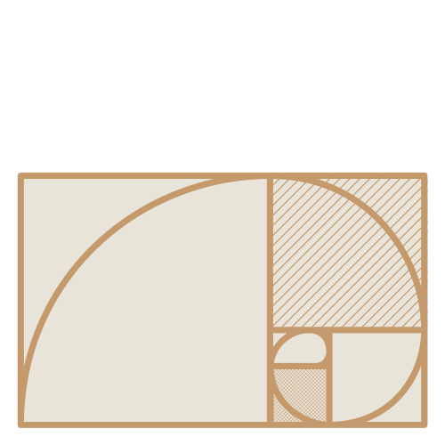
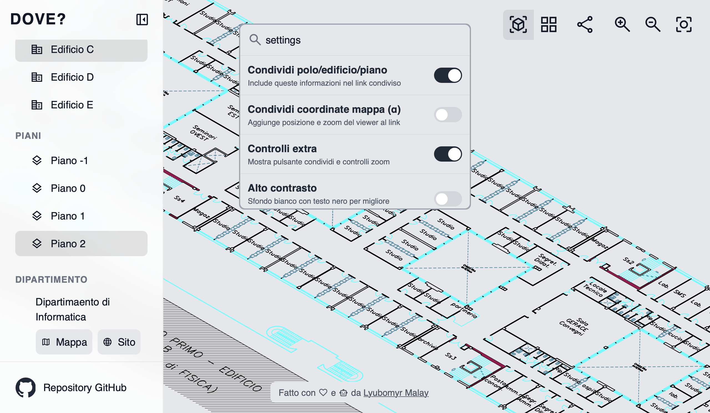

<p align="center">
  
</p>

<h1 align="center"> DOVE? UniPi </h1>

<p align="center">Un'applicazione web single-page (SPA) per esplorare gli edifici, i piani e le aule del Polo Fibonacci dell’Università di Pisa.</p>

<p align="center">L’interfaccia consente di navigare in modo interattivo tra gli edifici, visualizzare mappe .SVG dei piani e ottenere dettagli sulle singole aule.</p>


<h2 align="right"> SCREENSHOT </h2>

<p align="center">
  
</p>


## Indice

- [Indice](#indice)
- [Contributori](#contributori)
- [Perchè?](#perchè)
- [Struttura del progetto](#struttura-del-progetto)
- [rooms.json](#roomsjson)
- [Funzionalità](#funzionalità)
  - [SPA](#spa)
    - [Ricerca intelligente](#ricerca-intelligente)
    - [Accessibilità](#accessibilità)
    - [Keyboard shortcuts](#keyboard-shortcuts)
    - [Path sharing](#path-sharing)
  - [Funzionalità che vorrei aggiungere](#funzionalità-che-vorrei-aggiungere)
- [Problemi noti](#problemi-noti)
  

## Contributori

[](https://github.com/calba-droid)
[](https://github.com/plumkewe)
[](https://github.com/piorpiedev)

*Un ringraziamento speciale a chi ha dedicato il proprio tempo per la raccolta dati nelle aule.*


## Perchè?

<p align="right">(<a href="#indice">indice</a>)</p>


L'idea nasce da un'esigenza personale, sorta fin dal primo giorno di università, quando ci dissero di recarci in un'aula specifica, in un edificio di cui nessuno sapeva nulla.

Ho capito subito che non ero l'unico ad avere questo problema. Mi è capitato spesso, sia di persona che nelle chat di gruppo, di vedere richieste di aiuto per trovare un'aula.

A dimostrazione di ciò, ecco alcuni messaggi reali presi da un gruppo Telegram:

> "Qualcuno del corso C mi può aiutare a trovare l'aula per favore?"

> "Qualcuno sa dov'è l'aula M1?"

> "L'aula D3 dove è?"

> "Sapete dirmi dove è questa aula M1?"

> "L'aula H dov'è?"

...e tanti altri. Da qui l'ispirazione per il nome del progetto: **DOVE?**

> [!NOTE]
> Il proggetto è in sviluppo, contribuisci!


## Struttura del progetto

<p align="right">(<a href="#indice">indice</a>)</p>


```graphql
├── README.md
├── assets/
│   ├── logo/
│   │   └── logo.svg
│   └── screenshots/
├── data/
│   └── rooms.json <- file importante per far funzionare tutto
├── index.html
└── polo/ <- dove aggiungere altri poli
    └── fibonacci/
        ├── edificio/
        │   ├── a/
        │   │   └── piano/
        │   │       ├── 0-top-max.svg <- top sta per vista e max sta per non ottimizzato (non si usano)
        │   │       ├── 0-top.svg
        │   │       ├── 0.dwg <- file CAD del piano 
        │   │       ├── 0.svg <- vista prospettica
        │   │       ├── 1-top-max.svg
        │   │       ├── 1-top.svg
        │   │       ├── 1.dwg
        │   │       ├── 1.svg
        │   │       ├── 2-top-max.svg
        │   │       ├── 2-top.svg
        │   │       ├── 2.dwg
        │   │       └── 2.svg
        │   ├── b/
        │   │   └── ...
        │   ├── c/
        │   │   └── ...
        │   ├── d/
        │   │   └── ...
        │   └── e/
        │       └── ...
        └── mini-map.svg <- mini mappa (non si usa)
```

## rooms.json

<p align="right">(<a href="#indice">indice</a>)</p>


È il "database" dell'applicazione.

Contiene tutti i dati su edifici, piani e aule, e l'interfaccia viene costruita dinamicamente leggendo questo file. Per aggiornare i contenuti, basta modificare rooms.json senza toccare il codice.

```json
{
  "polo": {
    "fibonacci": {
      "edificio": {
        "a": {
          "..."
        },
        "b": {
          "..."
        },
        "c": {
          "..."
        },
        "d": {
          "piano": {
            "0": [
              {
                "id": "fib_d2-d-0",
                "nome": "Aula D2",
                "alias": [
                  "D2",
                  "Informatica",
                  "Corso B",
                  "Matricole",
                  "Matricole Informatica"
                ],
                "capienza": 206,
                "presenza_pc": false,
                "numero_pc": 0,
                "prese_elettriche": true,
                "numero_prese_elettriche": 0,
                "porte_rete": false,
                "proiettore": true,
                "lavagna": "nera",
                "type": "aula",
                "note": "",
                "rete": false,
                "accesso_disabili": true
              },
              {
                "..."
              },
              {
                "..."
              },
              {
                "..."
              }
            ]
          }
        },
        "e": {
          "..."
        }
      }
    }
  }
}
```

## Funzionalità

<p align="right">(<a href="#indice">indice</a>)</p>


### SPA

#### Ricerca intelligente 

Effettua una ricerca non solo sul nome dell’aula ma anche sui suoi **alias**.  
Supporta inoltre **filtri avanzati**: ad esempio, scrivendo `> 200` verranno mostrate le aule con capienza superiore a 200.  
Sono supportati gli operatori: `<`, `>`, `==`, `>=`, `<=`.

Puoi accedere alle **impostazioni** digitando `impostazioni` o `settings` nella barra di ricerca.  
Da lì puoi abilitare anche le **funzionalità sperimentali**.

Digitando `condividi` o `share`, potrai facilmente copiare il **link al sito** o a questa **repository** per condividerlo.


#### Accessibilità 

Attualmente è possibile aggiungere **pulsanti aggiuntivi** per alcune funzioni come **zoom** e **condivisione** ed attivare la **modalità ad alto contrasto**.

Puoi accedere alle **impostazioni di accessibilità** digitando `impostazioni` o `settings` nella barra di ricerca.  

In futuro si prevede di introdurre una **modalità di navigazione basata solo su pulsanti**.
*(Non garantiamo nulla in questa fase di sviluppo.)*

#### Keyboard shortcuts

Al momento sono disponibili le seguenti scorciatoie:

<table>
  <thead>
    <tr>
      <th>Funzione</th>
      <th>Mac</th>
      <th>Windows / Linux</th>
    </tr>
  </thead>
  <tbody>
    <tr>
      <td>Copia il link da condividere</td>
      <td><kbd>⌃</kbd> + <kbd>⌥</kbd> + <kbd>J</kbd></td>
      <td><kbd>Ctrl</kbd> + <kbd>Alt</kbd> + <kbd>J</kbd></td>
    </tr>
    <tr>
      <td>Centralizza la visuale</td>
      <td><kbd>⌃</kbd> + <kbd>⌥</kbd> + <kbd>K</kbd></td>
      <td><kbd>Ctrl</kbd> + <kbd>Alt</kbd> + <kbd>K</kbd></td>
    </tr>
  </tbody>
</table>


#### Path sharing

Per impostazione predefinita è attivo il **path sharing** di *polo*, *edificio* e *piano*. Questo significa che condividendo un link come:

```
https://plumkewe.github.io/dove-unipi/?p=fibonacci&b=a&f=0&v=top
```

la parte `?p=fibonacci&b=a&f=0&v=top` farà sì che chi apre il link visualizzi **lo stesso polo, edificio e piano** di chi lo ha condiviso.

Se non funziona, apri la barra di ricerca, digita `impostazioni` e verifica che l’opzione **“Condividi polo/edificio/piano”** sia attiva.

> In fase **alpha** è disponibile anche la condivisione delle **coordinate**: chi apre il link vedrà l’elemento esatto evidenziato sulla mappa.  
> Tuttavia, questa funzione è ancora instabile.


### Funzionalità che vorrei aggiungere

- [x] **Ricerca intelligente:** Una ricerca che ti auta con il complementamento automatico, e prende in considerazioni i valori alias presenti su rooms.json e altro
- [ ] **Occupazione aule:** Collegare in qualche modo University Planner da poter vedere le prenotazioni direttamente sul sito

## Problemi noti

<p align="right">(<a href="#indice">indice</a>)</p>


- [ ] **Zoom anomalo:** Lo zoom non si comporta come previsto
- [ ] **Visibilità bottone su Safari iOS:** Il bottnoe di GitHub nella sidebar non è visibile su Safari per iOS 26
- [ ] **Mappe non aggiornate:** I nomi di alcune aule sulle planimetrie SVG/DWG non corrispondono a quelli reali.