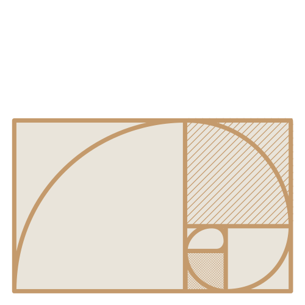
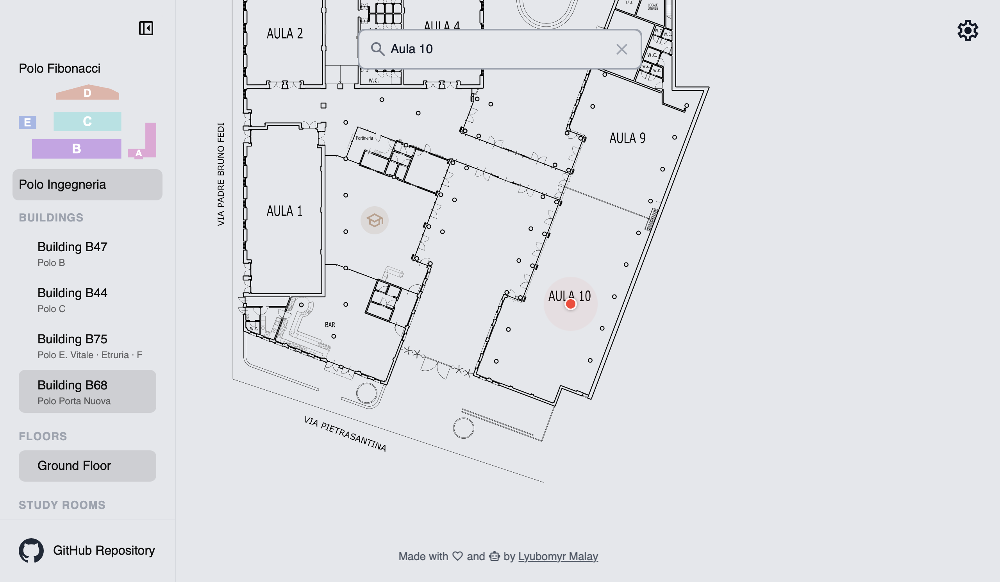
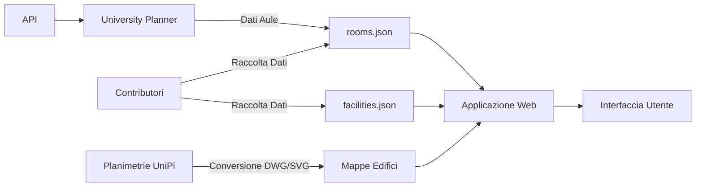
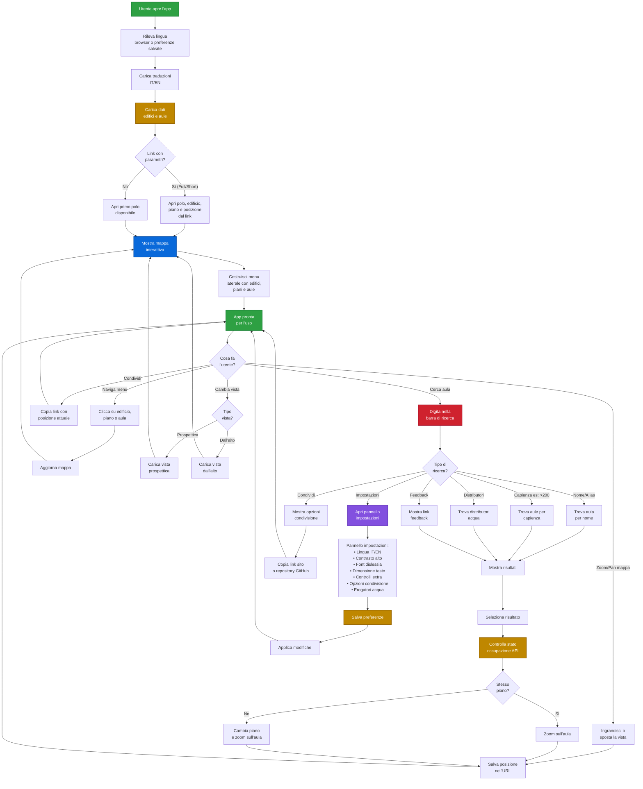
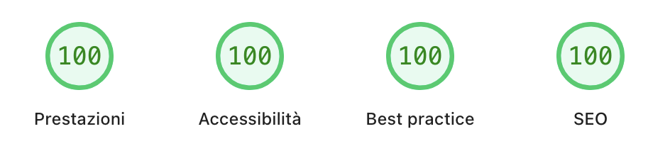
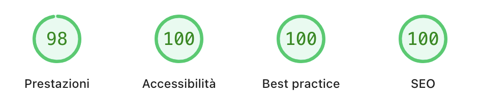
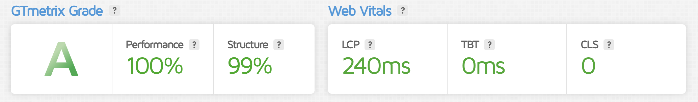
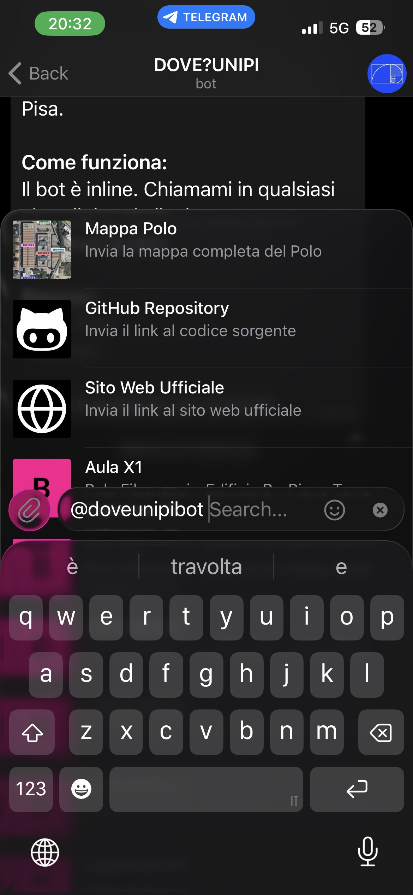
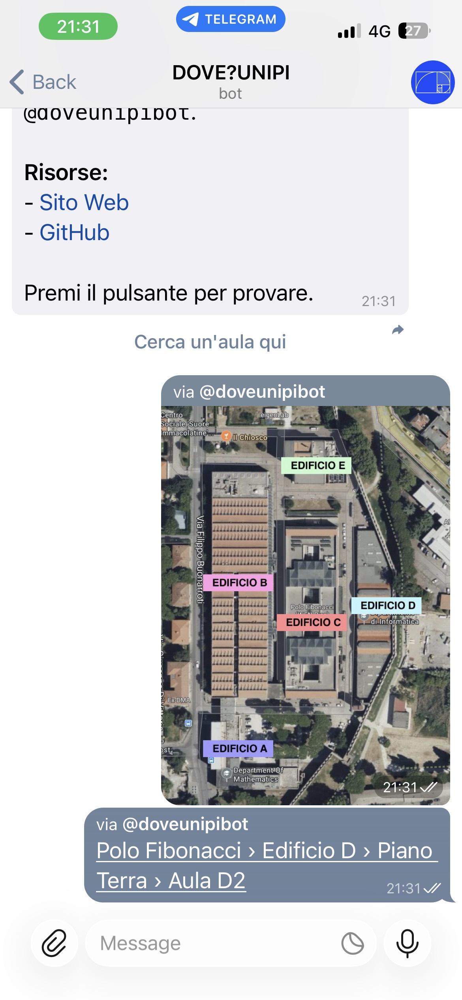

<p align="center">
  
</p>

<h1 align="center"> DOVE?UNIPI </h1>

<p align="center">Un'applicazione web single-page (SPA) per esplorare gli edifici, i piani e le aule del Polo Fibonacci dell’Università di Pisa.</p>

<p align="center">L’interfaccia consente di navigare in modo interattivo tra gli edifici, visualizzare mappe .SVG dei piani e ottenere dettagli sulle singole aule.</p>


<h2 align="right"> SCREENSHOT </h2>

<p align="center">
  
</p>

> Per rendere il progetto ulteriormente **accessibile a TUTTI**, oltre a un'interfaccia intuitiva e diretta, è disponibile una [**guida**](assets/screenshots/spiegazione.png) che spiega i vari elementi e pulsanti dell'applicazione.


## Indice

- [Indice](#indice)
- [Contributori](#contributori)
- [Perché?](#perché)
- [Struttura del progetto](#struttura-del-progetto)
- [rooms.json](#roomsjson)
- [Flowchart](#flowchart)
  - [Flusso Dati](#flusso-dati)
  - [Architettura del Progetto](#architettura-del-progetto)
- [Prestazioni](#prestazioni)
  - [PageSpeed Insights](#pagespeed-insights)
  - [GTmetrix](#gtmetrix)
- [Funzionalità](#funzionalità)
  - [Ricerca intelligente](#ricerca-intelligente)
  - [Accessibilità](#accessibilità)
  - [Keyboard shortcuts](#keyboard-shortcuts)
  - [Path sharing](#path-sharing)
  - [Lingue supportate](#lingue-supportate)
  - [Altri dati](#altri-dati)
    - [Distributori d'acqua](#distributori-dacqua)
    - [Aule Studio](#aule-studio)
- [API Orari Biblioteca](#api-orari-biblioteca)
  - [Endpoint](#endpoint)
  - [Parametri](#parametri)
  - [Esempio di chiamata](#esempio-di-chiamata)
  - [Risposta JSON](#risposta-json)
  - [Campi della risposta](#campi-della-risposta)
  - [Altre biblioteche disponibili](#altre-biblioteche-disponibili)
- [API Aule](#api-aule)
- [Telegram Bot](#telegram-bot)
- [Problemi noti](#problemi-noti)
  

## Contributori

[](https://github.com/calba-droid)
[](https://github.com/plumkewe)
[](https://github.com/piorpiedev)
[](https://github.com/L-myself)
[](https://github.com/gregoriop06)
[](https://github.com/alesmk)
[](https://github.com/juliusnixi)

*Un ringraziamento speciale a chi ha dedicato il proprio tempo per la raccolta dati nelle aule.*


## Perché?

<p align="right">(<a href="#indice">indice</a>)</p>


L'idea nasce da un'esigenza personale, sorta fin dal primo giorno di università, quando ci dissero di recarci in un'aula specifica, in un edificio di cui nessuno sapeva nulla.

Ho capito subito che non ero l'unico ad avere questo problema. Mi è capitato spesso, sia di persona che nelle chat di gruppo, di vedere richieste di aiuto per trovare un'aula.

A dimostrazione di ciò, ecco alcuni messaggi reali presi da un gruppo Telegram:

> "Qualcuno del corso C mi può aiutare a trovare l'aula per favore?"

> "Qualcuno sa dov'è l'aula M1?"

> "L'aula D3 dove è?"

> "Sapete dirmi dove è questa aula M1?"

> "L'aula H dov'è?"

...e tanti altri. Da qui l'ispirazione per il nome del progetto: **DOVE?**

> [!NOTE]
> Il progetto è in sviluppo, contribuisci!


## Struttura del progetto

<p align="right">(<a href="#indice">indice</a>)</p>


```graphql
├── README.md
├── assets/
│   ├── fonts/  
│   ├── logo/
│   │   ├── favicon.png
│   │   └── logo.svg
│   └── screenshots/
├── data/
│   ├── rooms.json      <- file importante per far funzionare tutto
│   └── facilities.json 
├── locales             <- cartella per le traduzioni 
│   └── en.json
│   └── it.json
├── index.html
└── polo/ <- dove aggiungere altri poli
    └── fibonacci/
        ├── edificio/
        │   ├── a/
        │   │   └── piano/
        │   │       ├── 0-top-max.svg <- top sta per vista e max sta per non si usano
        │   │       ├── 0-top.svg
        │   │       ├── 0.dwg <- file CAD del piano 
        │   │       ├── 0.svg <- vista prospettica
        │   │       ├── 1-top-max.svg
        │   │       ├── 1-top.svg
        │   │       ├── 1.dwg
        │   │       ├── 1.svg
        │   │       ├── 2-top-max.svg
        │   │       ├── 2-top.svg
        │   │       ├── 2.dwg
        │   │       └── 2.svg
        │   ├── b/
        │   │   └── ...
        │   ├── c/
        │   │   └── ...
        │   ├── d/
        │   │   └── ...
        │   └── e/
        │       └── ...
        └── mini-map.svg <- mini mappa (non si usa)
```

## rooms.json

<p align="right">(<a href="#indice">indice</a>)</p>


È il "database" dell'applicazione.

Contiene tutti i dati su edifici, piani e aule, e l'interfaccia viene costruita dinamicamente leggendo questo file. Per aggiornare i contenuti, basta modificare rooms.json senza toccare il codice.

```json
{
  "polo": {
    "fibonacci": {
      "edificio": {
        "a": {
          "..."
        },
        "b": {
          "..."
        },
        "c": {
          "..."
        },
        "d": {
          "rotate": true, <- valore true fa apparire il bottone per girare la cartina
          "piano": {
            "0": [
              {
                "id": "fib_d5-d-0",
                "nome": "Aula D5",
                "alias": [
                  "D5",
                  "Informatica",
                  "Matricole",
                  "Matricole Informatica"
                ],
                "capienza": 216,
                "presenza_pc": false,
                "numero_pc": 0,
                "prese_elettriche": true,
                "numero_prese_elettriche": 5,
                "porte_rete": true,
                "proiettore": true,
                "lavagna": true,
                "type": "aula",
                "note": "",
                "rete": false,
                "accesso_disabili": true,
                "coordinates": {
                  "x": 463,
                  "y": 295,
                  "zoom": 2
                },
                "hasStatus": true <- serve per evitare le chiamate API e mostrare animazione di cerca di un'aula che non ha lo status
              },
              {
                "..."
              },
              {
                "..."
              },
              {
                "..."
              }
            ]
          }
        },
        "e": {
          "..."
        }
      }
    }
  }
}
```

## Flowchart

<p align="right">(<a href="#indice">indice</a>)</p>

### Flusso Dati


```mermaid
graph LR
    A[Planimetrie UniPi] -->|Conversione DWG/SVG| B[Mappe Edifici]
    I[API] --> C[University Planner]
    C -->|Dati Aule| D[rooms.json]
    G[Contributori] -->|Raccolta Dati| H[facilities.json]
    G -->|Raccolta Dati| D
    D --> E[Applicazione Web]
    H --> E
    B --> E
    E --> F[Interfaccia Utente]
```

### Architettura del Progetto


```mermaid
graph TB
    Start[Utente apre l'app] --> DetectLang[Rileva lingua<br/>browser o preferenze salvate]
    DetectLang --> LoadTranslations[Carica traduzioni<br/>IT/EN]
    LoadTranslations --> LoadData[Carica dati<br/>edifici e aule]
    
    LoadData --> CheckURL{Link con<br/>parametri?}
    CheckURL -->|"Sì (Full/Short)"| UseURL[Apri polo, edificio,<br/>piano e posizione<br/>dal link]
    CheckURL -->|No| UseDefault[Apri primo polo<br/>disponibile]
    
    UseURL --> ShowMap[Mostra mappa<br/>interattiva]
    UseDefault --> ShowMap
    
    ShowMap --> BuildSidebar[Costruisci menu<br/>laterale con edifici,<br/>piani e aule]
    BuildSidebar --> Ready[App pronta<br/>per l'uso]
    
    Ready --> UserAction{Cosa fa<br/>l'utente?}
    
    %% Ricerca aula
    UserAction -->|Cerca aula| SearchBar[Digita nella<br/>barra di ricerca]
    SearchBar --> SearchType{Tipo di<br/>ricerca?}
    SearchType -->|Nome/Alias| FindByName[Trova aula<br/>per nome]
    SearchType -->|Capienza es: >200| FindByCapacity[Trova aule per<br/>capienza]
    SearchType -->|Impostazioni| OpenSettings[Apri pannello<br/>impostazioni]
    SearchType -->|Condividi| OpenShare[Mostra opzioni<br/>condivisione]
    SearchType -->|Feedback| OpenFeedback[Mostra link<br/>feedback]
    SearchType -->|Distributori| FindWater[Trova distributori<br/>acqua]
    
    FindByName --> ShowResults[Mostra risultati]
    FindByCapacity --> ShowResults
    FindWater --> ShowResults
    OpenFeedback --> ShowResults
    
    ShowResults --> SelectResult[Seleziona risultato]
    SelectResult --> CheckOccupancy[Controlla stato<br/>occupazione API]
    CheckOccupancy --> CheckFloor{Stesso<br/>piano?}
    
    CheckFloor -->|Sì| ZoomToRoom[Zoom sull'aula]
    CheckFloor -->|No| ChangeFloor[Cambia piano<br/>e zoom sull'aula]
    
    %% Navigazione manuale
    UserAction -->|Naviga menu| ClickSidebar[Clicca su edificio,<br/>piano o aula]
    ClickSidebar --> UpdateMap[Aggiorna mappa]
    UpdateMap --> ShowMap
    
    %% Zoom e pan
    UserAction -->|Zoom/Pan mappa| InteractMap[Ingrandisci o<br/>sposta la vista]
    InteractMap --> SavePosition[Salva posizione<br/>nell'URL]
    
    %% Condivisione
    UserAction -->|Condividi| CopyLink[Copia link con<br/>posizione attuale]
    CopyLink --> Ready
    
    %% Cambio vista
    UserAction -->|Cambia vista| SwitchView{Tipo<br/>vista?}
    SwitchView -->|Prospettica| LoadPerspective[Carica vista<br/>prospettica]
    SwitchView -->|Dall'alto| LoadTop[Carica vista<br/>dall'alto]
    LoadPerspective --> ShowMap
    LoadTop --> ShowMap
    
    %% Impostazioni
    OpenSettings --> SettingsPanel[Pannello impostazioni:<br/>• Lingua IT/EN<br/>• Contrasto alto<br/>• Font dislessia<br/>• Dimensione testo<br/>• Controlli extra<br/>• Opzioni condivisione<br/>• Erogatori acqua]
    SettingsPanel --> SaveSettings[Salva preferenze]
    SaveSettings --> ApplySettings[Applica modifiche]
    ApplySettings --> Ready
    
    %% Condivisione
    OpenShare --> ShareOptions[Copia link sito<br/>o repository GitHub]
    ShareOptions --> Ready
    
    %% Torna all'app
    ZoomToRoom --> SavePosition
    ChangeFloor --> SavePosition
    SavePosition --> Ready
    
    style Start fill:#2ea043,stroke:#1a7f37,stroke-width:2px,color:#ffffff
    style Ready fill:#2ea043,stroke:#1a7f37,stroke-width:2px,color:#ffffff
    style ShowMap fill:#0969da,stroke:#0550ae,stroke-width:2px,color:#ffffff
    style SearchBar fill:#cf222e,stroke:#a40e26,stroke-width:2px,color:#ffffff
    style OpenSettings fill:#8250df,stroke:#6639ba,stroke-width:2px,color:#ffffff
    style LoadData fill:#bf8700,stroke:#9a6700,stroke-width:2px,color:#ffffff
    style SaveSettings fill:#bf8700,stroke:#9a6700,stroke-width:2px,color:#ffffff
    style CheckOccupancy fill:#bf8700,stroke:#9a6700,stroke-width:2px,color:#ffffff
```

## Prestazioni

<p align="right">(<a href="#indice">indice</a>)</p>

### PageSpeed Insights

<table>
  <thead>
    <tr>
      <th>DESKTOP</th>
      <th>MOBILE</th>
    </tr>
  </thead>
  <tbody>
    <tr>
      <td align="center" valign="middle"></td>
      <td align="center" valign="middle"></td>
    </tr>
    <tr>
      <td colspan="2"><a href="https://pagespeed.web.dev/analysis/https-plumkewe-github-io-dove-unipi/afk26zbvgu" target="_blank" rel="noopener noreferrer">Apri il report completo su PageSpeed Insights</a></td>
    </tr>
  </tbody>
</table>

### GTmetrix

<table>
  <tbody>
    <tr>
      <td align="center" valign="middle"></td>
    </tr>
    <tr>
      <td><a href="https://gtmetrix.com/reports/plumkewe.github.io/BjkJjwUk/" target="_blank" rel="noopener noreferrer">Apri il report completo su GTmetrix</a></td>
    </tr>
  </tbody>
</table>

## Funzionalità

<p align="right">(<a href="#indice">indice</a>)</p>


### Ricerca intelligente 

Effettua una ricerca non solo sul nome dell’aula ma anche sui suoi **alias**. Una volta selezionata, l’aula verrà automaticamente zoomata sulla sua posizione (ovviamente, se le coordinate sono presenti nel file rooms.json).

Supporta inoltre **filtri avanzati**: ad esempio, scrivendo `> 200` verranno mostrate le aule con capienza superiore a 200.  
Sono supportati gli operatori: `<`, `>`, `==`, `=`, `>=`, `<=`, `" "`.

Puoi accedere alle **impostazioni** digitando `impostazioni` o `settings` nella barra di ricerca.  
Da lì puoi abilitare anche le **funzionalità sperimentali**.

Digitando `condividi` o `share`, potrai facilmente copiare il **link al sito** o a questa **repository** per condividerlo.

Digitando `feedback` troverai due risultati per fornire feedback sul progetto. Inoltre, quando non trovi ciò che cerchi, ti verrà proposto automaticamente di lasciare un feedback per aiutarci a migliorare!

Usa le frecce <kbd>↑</kbd> e <kbd>↓</kbd> per scorrere i risultati e premi <kbd>Enter</kbd> per selezionarne uno.
La ricerca si avvia automaticamente mentre digiti — non serve cliccare sulla barra di ricerca. Inoltre, se il risultato è unico oppure stai per cercare una special keyword (`impostazioni`, `feedback`, `condividi`...), ti basterà premere <kbd>Enter</kbd> per avviare la ricerca.

Grazie all'API di JuliusNixi è possibile visualizzare l'occupazione delle aule in tempo reale. In futuro verrà implementata la possibilità di applicare filtri per visualizzare esclusivamente le aule libere.

<hr>

### Accessibilità 

Attualmente è possibile aggiungere **pulsanti extra** per funzioni come **zoom** e **condivisione,** oltre ad attivare la **modalità ad alto contrasto.**
È inoltre possibile aumentare **la dimensione del testo**, attivare il **font per dislessia (OpenDyslexic)** e scegliere la preferenza per mostrare il piano terra come **"Piano 0"** o **"Piano Terra"**.

Puoi accedere alle **impostazioni di accessibilità** digitando `impostazioni` o `settings` nella barra di ricerca.  

In futuro si prevede di introdurre una **modalità di navigazione basata solo su pulsanti**.
*(Non garantiamo nulla in questa fase di sviluppo.)*

<hr>

### Keyboard shortcuts

Al momento sono disponibili le seguenti scorciatoie:

<table>
  <thead>
    <tr>
      <th>Funzione</th>
      <th>Mac</th>
      <th>Windows / Linux</th>
    </tr>
  </thead>
  <tbody>
    <tr>
      <td>Copia il link da condividere</td>
      <td><kbd>⌃</kbd> + <kbd>⌥</kbd> + <kbd>J</kbd></td>
      <td><kbd>Ctrl</kbd> + <kbd>Alt</kbd> + <kbd>J</kbd></td>
    </tr>
    <tr>
      <td>Centra la visuale</td>
      <td><kbd>⌃</kbd> + <kbd>⌥</kbd> + <kbd>K</kbd></td>
      <td><kbd>Ctrl</kbd> + <kbd>Alt</kbd> + <kbd>K</kbd></td>
    </tr>
    <tr>
      <td>Apri/Chiudi Sidebar</td>
      <td><kbd>⌘</kbd> + <kbd>Enter</kbd></td>
      <td><kbd>Ctrl</kbd> + <kbd>Enter</kbd></td>
    </tr>
  </tbody>
</table>

<hr>

### Path sharing

Per impostazione predefinita è attivo il **path sharing** di *polo*, *edificio*, *piano* e *coordinate*.  
Questo significa che, condividendo un link come:

```
https://plumkewe.github.io/dove-unipi/?p=fibonacci&b=a&f=0&v=top&x=504.00&y=322.42&z=1.00
```

la parte  
```
?p=fibonacci&b=a&f=0&v=top&x=504.00&y=322.42&z=1.00
```
permetterà a chi apre il link di visualizzare **lo stesso polo, edificio, piano** e anche l’**elemento evidenziato** di chi lo ha condiviso.

Se la funzione non dovesse funzionare, apri la **barra di ricerca**, digita `impostazioni` e verifica che le opzioni **“Condividi polo/edificio/piano”** e **“Condividi coordinate mappa”** siano attive.

Inoltre, se utilizzi la funzione di **ricerca** o selezioni un elemento dalla **sidebar** senza muoverti sulla mappa, il link generato sarà molto più breve e includerà solo il *polo* e il nome abbreviato (se disponibile) dell’aula, dipartimento, laboratorio e sala.

Ad esempio:
```
https://plumkewe.github.io/dove-unipi/?p=fibonacci&c=D2
```

Corrisponde a:
```
https://plumkewe.github.io/dove-unipi/?p=fibonacci&b=d&f=0&v=top&x=380.00&y=296.00&z=2.00
```

Aprendo quel link, oltre all’aula verranno mostrati anche i dati relativi alla ricerca, quindi la sua posizione, la capienza e lo stato.

<hr>

### Lingue supportate

Attualmente sono supportate due lingue: **italiano** e **inglese.**

In futuro verranno aggiunte altre **lingue!**

> [!NOTE]
> **Vuoi contribuire con una traduzione?**  
> Apri una [issue](https://github.com/plumkewe/dove-unipi/issues) oppure inviami un'email a: [lyubomyr.malay@icloud.com](mailto:lyubomyr.malay@icloud.com)  
> **Grazie per il supporto!**

<hr>

### Altri dati

#### Distributori d'acqua

È disponibile in **versione alfa** la possibilità di visualizzare i **distributori d'acqua** presenti negli edifici del Polo Fibonacci.

Per attivarla, apri la **barra di ricerca**, digita `impostazioni` e assicurati che l'opzione **"Mostra erogatori d'acqua (ALFA)"** sia attiva.

Puoi cercare i distributori digitando `Dist...` nella barra di ricerca. I risultati saranno evidenziati con un **colore blu**, come omaggio al progetto [**CoSA** dell'Università di Pisa ↗](https://sostenibile.unipi.it)

> [!NOTE]
> **Hai trovato distributori non mappati?**  
> Ci servono dati sulla posizione di **distributori d'acqua**, **distributori di caffè**, **distributori di cibo...**
> Apri una [issue](https://github.com/plumkewe/dove-unipi/issues) oppure inviami un'email a: [lyubomyr.malay@icloud.com](mailto:lyubomyr.malay@icloud.com)  
> **Grazie per il supporto!**

<hr>

#### Aule Studio

È possibile visualizzare le **aule studio** presenti negli edifici del Polo Fibonacci.
Questa funzione permette di attivare dei marker specifici sulla mappa per individuare facilmente le zone studio.

Per attivarla, apri la **barra di ricerca**, digita `impostazioni` e attiva l'opzione **"Mostra aule studio (ALFA)"**.
I marker appariranno sulla mappa indicando la posizione esatta delle aule dedicate allo studio.

## API Orari Biblioteca

<p align="right">(<a href="#indice">indice</a>)</p>

Il progetto utilizza l'API pubblica del Sistema Bibliotecario di Ateneo (SBA) dell'Università di Pisa per ottenere gli orari di apertura delle **Biblioteche**.

### Endpoint

```
GET https://www.sba.unipi.it/it/opening_hours/instances
```

### Parametri

| Parametro | Tipo | Descrizione |
|-----------|------|-------------|
| `from_date` | string | Data di inizio (formato: `YYYY-MM-DD`) |
| `to_date` | string | Data di fine (formato: `YYYY-MM-DD`) |
| `nid` | string | ID della biblioteca (`1185` = Fisica) |

### Esempio di chiamata

```bash
curl "https://www.sba.unipi.it/it/opening_hours/instances?from_date=2025-12-05&to_date=2025-12-12&nid=1185"
```

### Risposta JSON

```json
[
  {
    "nid": 1185,
    "date": "2025-12-05",
    "start_time": "\n09:00",
    "end_time": "20:00",
    "notice": null
  },
  {
    "nid": 1185,
    "date": "2025-12-09",
    "start_time": "09:00",
    "end_time": "20:00",
    "notice": null
  }
]
```

> [!WARNING]
> I campi `start_time` e `end_time` possono contenere caratteri di spaziatura o newline (es. `"\n09:00"`). Si consiglia di effettuare sempre il `.trim()` di questi valori prima dell'utilizzo.

### Campi della risposta

| Campo | Descrizione |
|-------|-------------|
| `nid` | ID della biblioteca |
| `date` | Data (formato `YYYY-MM-DD`) |
| `start_time` | Orario di apertura |
| `end_time` | Orario di chiusura |
| `notice` | Eventuali avvisi o note |


### Altre biblioteche disponibili

| NID | Biblioteca |
|-----|------------|
| 1173 | Agraria |
| 1174 | Anglistica |
| 1177 | Antichistica |
| 1178 | Economia |
| 1179 | Filosofia e Storia |
| 1184 | Chimica |
| 1185 | Fisica |
| 1187 | Informatica |
| 1195 | Giurisprudenza |
| 1196 | Ingegneria |
| 1197 | Matematica |
| 1198 | Medicina |
| 1213 | Scienze Politiche |
| 1361 | CIPEI |
| 1362 | Archivio generale di Ateneo |
| 1409 | Storia e Romanistica |
| 1477 | Scienze del turismo (Lucca) |
| 1481 | Sistemi logistici (Livorno) |

> [!NOTE]
> L'API è pubblica e non richiede autenticazione.
> L'API non supporta CORS. Per le richieste dirette da browser (client-side), è necessario utilizzare un proxy CORS (nel progetto viene usato `api.allorigins.win` come fallback).
> Fonte: [sba.unipi.it/it/biblioteche/orari-di-apertura-delle-sedi](https://www.sba.unipi.it/it/biblioteche/orari-di-apertura-delle-sedi)

<hr>

## API Aule

<p align="right">(<a href="#indice">indice</a>)</p>

Il progetto include un servizio API (sviluppato in Python con Flask) che permette di ottenere informazioni in tempo reale sullo stato delle aule, effettuando lo scraping del portale [aule.webhost1.unipi.it](https://aule.webhost1.unipi.it/poli-didattici/).

Le API offrono diversi endpoint per recuperare:
- L'elenco dei poli didattici.
- Le aule di un determinato polo.
- L'orario completo, lo stato attuale o le attività future di una specifica aula.
- L'elenco delle aule libere in un dato momento.

Il servizio utilizza `requests` e `playwright` per il recupero dei dati e implementa un sistema di caching per ottimizzare le prestazioni e ridurre il carico sul server di origine.

>[!NOTE]
>L'API pubblica originale è quella di Giulio e la trovate qui: https://github.com/JuliusNixi/unipi-free-classrooms-now
>Quella utilizzata in questo progetto è stata modificata per poter essere eseguita su Azure.

## Telegram Bot

<p align="right">(<a href="#indice">indice</a>)</p>

È stato creato un **Telegram Bot inline**, attualmente in fase di **beta test**, ma già disponibile per essere provato. Puoi accedervi seguendo questo link: [**@doveunipibot**](https://t.me/doveunipibot).

Il bot mostra le stesse informazioni disponibili tramite la ricerca sul sito. E anche alcune funzionalità aggiuntive come ad esempio la posibilità di mandare la mappa del polo con il nome degli edifici.

<table>
  <tr>
    <td align="center" valign="middle"></td>
    <td align="center" valign="middle"></td>
    <td align="center" valign="middle"></td>
  </tr>
</table>

**Hostato su:**

<p align="center">
  <a>
    
  </a>
</p>

## Problemi noti

<p align="right">(<a href="#indice">indice</a>)</p>

- [ ] **Mappe non aggiornate:** I nomi di alcune aule sulle planimetrie SVG/DWG non corrispondono a quelli reali.